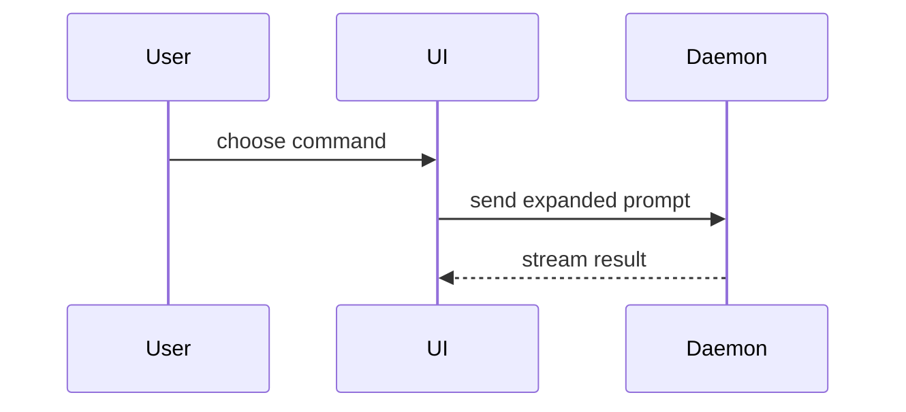

## Young Muslims project requirements

Before doing any work in this repository:

1. Read `AGENTS.md`, `CLAUDE.md`, `WIREFRAME.md`, and `DESIGN-SYSTEM.md` in full. Treat them as required context for analysis, design, review, research, writing, and implementation, and respect the current wireframe-versus-production boundary they define.
2. For every Next.js question or change, locate the installed `next` package and read the relevant guide under `node_modules/next/dist/docs/` before drawing conclusions or writing code. These bundled docs are the framework authority for this repository and override remembered conventions or external guides when they differ.
3. Run `git status --short` before editing. Preserve all unrelated dirty-worktree changes: do not reset, restore, overwrite, stage, reformat, or otherwise absorb them into the task.
4. Never commit or push unless the user explicitly requests that action in the current task.

For reviews and validation:

- Review user-facing changes for fidelity to the approved Figma source and its `DESIGN-SYSTEM.md` translation; accessibility, including semantics, keyboard use, focus, contrast, and appropriate ARIA; responsive behavior at the currently supported widths without inventing undesigned mobile behavior; reduced-motion behavior; and asset provenance, licensing, source, and approved usage.
- Do not perform browser-based or screenshot-based visual comparison unless the user explicitly requests it. Functional browser testing remains available when it is the right non-visual verification tool.
- Choose checks in proportion to change risk. Run `bun run format:check` for edited repository files, `bun run lint` for source changes, `bun run typecheck` for TypeScript, JavaScript, Next.js, configuration, or type-surface changes, and `bun run build` when routing, rendering, assets, dependencies, build configuration, or other production behavior could change. Run all four for broad or high-risk application changes. If an applicable check cannot run or is intentionally skipped, state why and report any failure without modifying unrelated code to make it pass.

Use this template for writing the PR body:

```markdown
## Summary

<diagram, diff-sketch, or tree>

## Evidence

- **Before:** <screenshot/output/failing test run>
  **After:** <screenshot/output/passing test run>

## Merge Danger

**Door:** <one-way or two-way>

<optional: description>

**Blast Radius:** <one-word description>

<optional: potential ramifications of merge>
```

## Sections

Skip all preambles and keep prose brief. Use the user's domain language from `GLOSSARY.md`.

### Summary

Pick the smallest view that makes the key point clear.

- Show logic or an algorithm as pseudocode:

```text
on(save)
  if content is unchanged
    return cached result
  write new content
  return fresh result
```

- Show runtime control flow as a call tree:

```text
submitForm
  createSession
    persistPrompt
    launchAgent
  navigateToSession
```

- Show UI structure as a component tree, including state and module boundaries that matter:

```text
<SessionPage> (apps/example/src/routes/session.tsx)
  useSessionEvents()
  <SessionToolbar>
    <RunSkillButton> (packages/ui)
```

- Show file responsibility or a broad refactor as a shallow file tree:

```text
src/
├── commands/       # parses user actions
├── sessions/       # owns session state
└── transport/      # sends API requests
```

- Show component interaction, control flow, or data flow with Mermaid:



- Use `diff` when the point is what changes and the surrounding shape already exists. Match the diff shape to the topic.

For a component change:

```diff
 <SessionPage>
   useSessionEvents()
   <SessionToolbar>
+    <RunSkillButton />
   <SessionTimeline>
+    <SkillResultCard />
```

For a file-layout change:

```diff
 src/
 ├── commands/
+│   └── show-me.ts       # expands the slash command
 ├── sessions/
-└── transport.ts
+└── transport/
+    ├── client.ts
+    └── stream.ts
```

For a call-tree or call-stack change:

```diff
 submitForm
   createSession
     persistPrompt
+    expandSkillMention
     launchAgent
-  navigateToSession
+  navigateToSession
+    subscribeToEvents
```

For a state or control-flow change:

```diff
 on(save)
-  write content
+  if content is unchanged
+    return cached result
+  write new content
+  invalidate cache
```

- Show the whole block when most of it is new, when omitted context would hide ownership or order, or when the user needs a copyable target shape:

```ts
function expandSkill(command: string): string {
  const skillName = command.slice(1);
  return `use the ${skillName} skill`;
}
```

#### Guidance

Place each visual next to the short text it supports. Keep only the calls, files, props, states, and boundaries needed to answer the user's current question or the options to resolve the current discussion point.

You may use one of these, you may use several, it is unlikely you will use all of them. Use your judgement and don't overwhelm the user.

### Evidence

Concrete evidence that the change works. Show a before and after.

Screenshots are S-tier - when the environment is set up for it and the change is visual.

Execution-based evidence is A-tier. Test results, console output. Show the exact test that now fails and passes, using pseudocode.

### Merge Danger

Describe whether it's a one-way or two-way door. You can walk back through two-way doors, but not one-way doors. A PR that is cheap to roll back is lower risk. Changes that involve destructive actions or hard-to-reverse decisions are one-way doors.

The blast radius is the potential impact or scope of the changes introduced by this PR. Consider all possibilities. Examples are layout shift, breakages for consumers, mobile responsiveness, etc.
